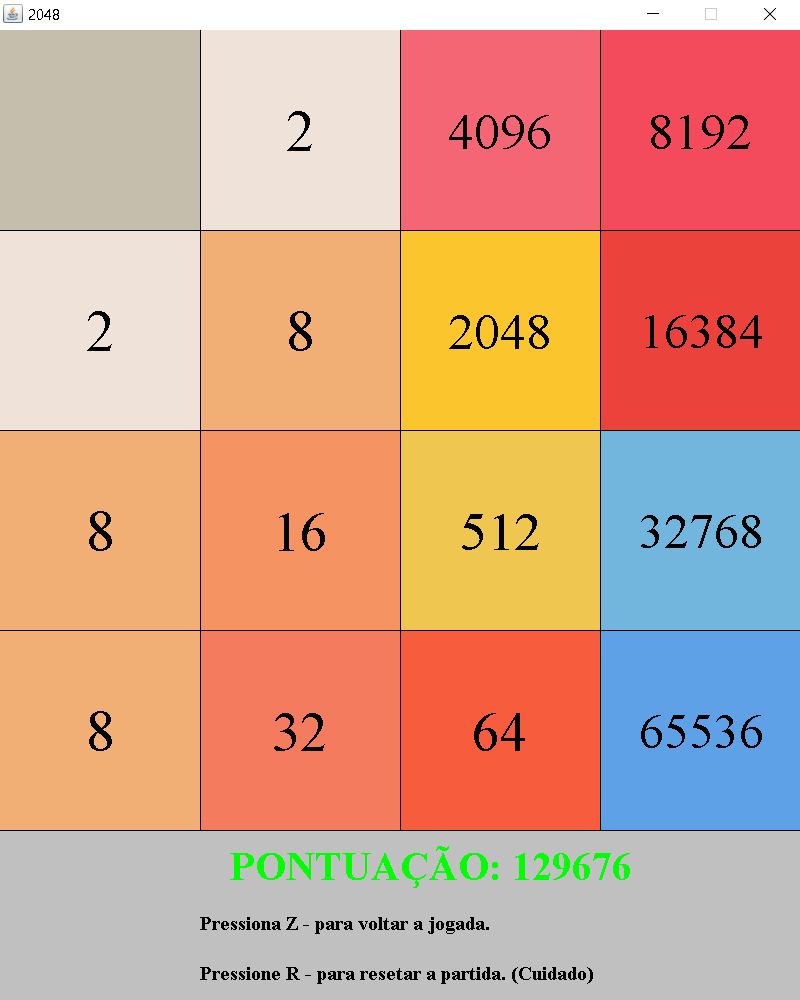

#2048

Projeto criado na linguagem java que visa de forma econômica e legível, criar um código modular.
Quanto a parte gráfica, é algo ainda em andamento por eu não ter ainda muita prática, mas que vem tendo progresso.

**Métodos utilizados:**
- Readme ainda em construção.

**Screenshots**:
 

**Coisas a fazer:**
- Centralizar melhor os números dentro do seu quadrado.
- Colocar mais contraste nos números.
- Adicionar tela de perdeu.
- Organizar melhor os arquivos de código e seus nomes.

**Version: 1.0.0**