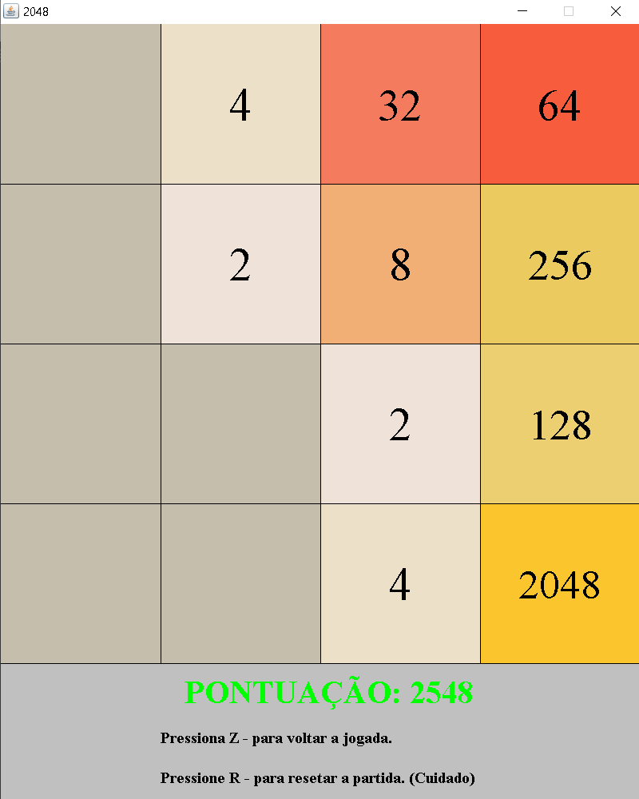

#2048

Projeto criado na linguagem java que visa de forma econômica e legível, criar um código modular.
Quanto a parte gráfica, é algo ainda em andamento por eu não ter ainda muita prática, mas que vem tendo progresso.

**Como jogar:**

- Baixe o arquivo <a href="https://github.com/lucasgsa/2048Java/blob/master/2048.jar?raw=true">2048.jar</a> contido nesse repositório e execute. (é preciso conter java instalado na sua máquina.)
- Utilize as teclas direcionais do seu teclado para mover as peças.
- <a href="https://www.techtudo.com.br/dicas-e-tutoriais/noticia/2014/03/2048-aprenda-jogar-o-viciante-game-de-raciocinio-para-android-e-pc.html">Link para um tutorial de como funciona o jogo e como jogar.</a>
- Seu objetivo é chegar ao número 2048 em alguma das peças, mas mesmo depois de chegar você ainda pode continuar jogando.

**Métodos utilizados:**

- Readme ainda em construção.

**Screenshots**:

  

**Coisas a fazer:**

- Centralizar melhor os números dentro do seu quadrado.
- Colocar mais contraste nos números.
- Adicionar tela de perdeu.
- Organizar melhor os arquivos de código e seus nomes.
- Criar animações e sons.
- Salvar o recorde.

**Version: 1.0.0**